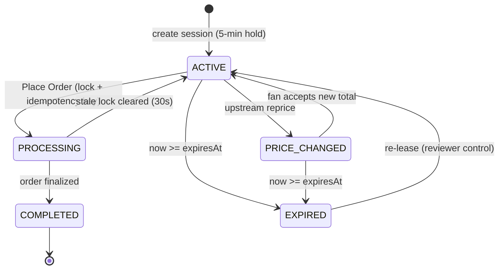

# Gametime Checkout Continuity & Concurrency Engine

A real-time, cross-surface checkout system built to eliminate friction and race conditions when fans transition between Desktop Web and Mobile Web/App surfaces.

The engine preserves active ticket reservations, synchronizes inventory lease countdowns, recovers from dynamic marketplace price drift, and prevents duplicate orders when multiple devices complete the same session.

**Live Deployment:** The production prototype is live and deployed on Render at https://gametime-checkout-continuity.onrender.com/.

---

## 1. What Was Built & How to Run It

### Architecture Overview

- **Frontend:** Next.js (App Router), React, TypeScript, Tailwind CSS.
- **State & Data Synchronization:** TanStack React Query with deterministic server-anchored timestamps, zero-waterfall client hydration, and automated polling.
- **Continuous Integration & Testing:** Playwright E2E suite (5 scenarios covering the core continuity transitions: hand-off, price drift, duplicate completion, lease expiry, and stale-session restore) running on Node 24 in GitHub Actions.
- **Mobile Cross-Device QR Engine:** Dynamic client-side SVG QR code generator (`qrcode.react`) for camera-based cross-device testing.

---

### Local Setup & Verification

```bash
# 1. Clone the repository and install dependencies
git clone https://github.com/RobF1011/gametime-checkout-continuity.git
cd gametime-checkout-continuity
npm install

# 2. Run the Playwright E2E verification suite (all 5 scenarios)
npm run test:e2e
# or
npx playwright test

# 3. Start the local development server
npm run dev
```

Visit `http://localhost:3000` and click **Hold Tickets & Start Checkout** to create a session. You land on `/checkout/{sessionId}?demo=true`.

Session IDs are UUIDv7, so each ID carries its creation time. A hand-typed or outdated ID resolves to an `EXPIRED` session rather than a fresh hold (see [Stale Inventory](#stale-inventory-lease-expiry)).

- **Live Demo / Split View:** Append `?demo=true` to view Desktop Surface A side-by-side with an interactive Mobile Safari viewport on a single screen.
- **Mobile Cross-Device Hand-Off:** Click **"Show QR"** on any desktop surface and scan it with a smartphone camera to resume the exact session instantly.

---

## 2. Checkout Session State Model

All transitions live in `src/lib/store/inMemoryStore.ts`. Every read and write passes through `evaluateSessionState`, which computes expiry from the server clock against `expiresAt`. Expiry is evaluated on access rather than scheduled by a timer.



| State           | Checkout Allowed | Description                                                                                         |
| --------------- | ---------------- | --------------------------------------------------------------------------------------------------- |
| `ACTIVE`        | **Yes**          | Inventory held under a 5-minute lease (`expiresAt = createdAt + 300s`).                             |
| `PRICE_CHANGED` | **Blocked**      | Upstream price drift detected. Checkout is blocked until the fan explicitly accepts the new total.  |
| `PROCESSING`    | **Blocked**      | Completion lock held by one surface (30s timeout). Other surfaces receive `409`.                    |
| `EXPIRED`       | **Blocked**      | Lease window elapsed. The hold is released.                                                         |
| `COMPLETED`     | **Terminal**     | Order finalized with an order ID. Repeat submissions with the same idempotency key return that order. |

`FAILED` (payment declined) is defined in the domain types but is not implemented in this prototype; see [What I'd Do Differently](#6-what-id-do-differently-with-more-time).

---

## 3. Cross-Surface Session Resumption (Web & Mobile)

Whether a user starts on Desktop Web, clicks a continuity deep link, or scans the on-screen QR code from their phone, both surfaces resume the exact same session via a unified continuity contract:

1. **Deterministic SSR Hydration:** The server-rendered page (`/checkout/[sessionId]`) pre-fetches the current session state and renders with a deterministic timestamp anchor. The client mounts without text mismatch errors or cascading layout shifts.
2. **Surface Context Propagation:** Each client specifies its surface origin via query parameter (`?surface=desktop_web` or `?surface=mobile_web`). This allows analytics, audit logs, and payment method prioritization (e.g., Apple Pay on mobile vs. credit card on desktop) while binding to the single underlying checkout session ID.
3. **Continuous Polling Synchronization:** Active sessions poll `GET /api/checkout/[sessionId]` on a 2-second heartbeat. When Surface A mutates state (e.g., placing an order or accepting a price change), Surface B reflects that change on its next tick and automatically stops polling once a terminal state (`COMPLETED` or `EXPIRED`) is reached.

---

## 4. Handling Concurrency, Drift & Edge Cases

### Stale Inventory (Lease Expiry)

- Holds expire based on the server-authoritative `expiresAt` epoch timestamp. The client countdown is for display only.
- `POST /complete` checks `now >= expiresAt` directly before acquiring the lock, independent of the stored status, and rejects with HTTP `400` (`TTL_EXPIRED`).
- **Restore without re-granting:** if the in-memory store loses a session (e.g. a process restart), the restore fallback derives `createdAt` from the UUIDv7 session ID and recomputes `expiresAt`. An elapsed hold comes back as `EXPIRED`, never as a fresh lease. IDs without a readable timestamp are treated as expired.
- **Backgrounded tabs:** polling pauses while a tab is hidden. On return (`visibilitychange`, or a back/forward-cache `pageshow` on mobile Safari), and whenever the local countdown reaches 0:00, the client refetches immediately. It also disables **Place Order** until the server confirms the state.
- Both surfaces display an "Inventory Lease Expired" notification. A reviewer-only "Re-lease Listing" action resets the session with a new 5-minute hold.

### Upstream Price Drift

- High-demand event pricing updates frequently. If ticket prices fluctuate while a user is in transit between devices, the session transitions to `PRICE_CHANGED` and records a `priceDrift` metadata envelope:
  `delta = newTotal - previousTotal`
- Checkout actions on both surfaces are disabled.
- The UI displays a warning banner highlighting the exact dollar variance with a strikethrough comparison.
- The user must execute `POST /api/checkout/[sessionId]/accept-price` to acknowledge the new total. Once accepted, the session returns to `ACTIVE` across all connected devices.

### Race Conditions & Duplicate Completion (Atomic Locking)

When a user attempts to tap "Place Order" on desktop and mobile simultaneously:

1. **Processing Lock:** The completion endpoint takes a lock on the session record (`PROCESSING`, 30s timeout). In this prototype, completion runs synchronously in a single Node process, so the event loop is what makes it atomic. The lock shows the shape an asynchronous payment flow needs; production would enforce it with a conditional write and a unique order-per-session constraint.
2. **Idempotency Guard:** Every submission passes a surface-scoped `idempotencyKey`. A repeated request with the same key after completion returns the existing order ID instead of creating a second order.
3. **Collision Rejection (`409 Conflict`):** A second device attempting completion receives `409`. The code is `CONCURRENT_PROCESSING_CONFLICT` if the first device's lock is still held, or `ALREADY_COMPLETED` if the order is finalized.
4. **Terminal Convergence:** Surface A renders the confirmed order and order ID immediately via an optimistic cache update. Surface B picks up the new status on its next poll and shows the same terminal state.

---

## 5. Trade-offs Made

- **In-Memory Store vs. Distributed Cache:**
  The prototype implements session state and mutexes using an in-memory store attached to `globalThis`. This provides zero-dependency local execution and instant Playwright test runs without needing external Docker containers or credentials.
- **HTTP Polling vs. WebSocket/SSE Push:**
  A 2-second polling interval with TanStack Query was chosen for rapid implementation, automatic network failure retries, and clean cache invalidation. While lightweight for a prototype, it incurs periodic HTTP request overhead compared to persistent push connections.
- **Container Persistence vs. Serverless Lambdas:**
  Serverless runtimes (such as Vercel) spread requests across separate containers, so an in-memory store diverges between polls. The prototype runs locally or on a single persistent instance (Render), where one Node process holds all state. That still does not survive restarts or spin-downs; the UUIDv7 restore path makes lost state fail closed (expired) rather than open, but a durable store is the real fix.

---

## 6. What I'd Do Differently With More Time

### 1. Centralized Distributed Locking (Redis + Redlock)

Replace the in-memory Map with Redis (or a transactional database):

- Use native key expiry (`SET session:{id} {data} NX EX 300`) to offload hold expiration timers from application logic.
- Implement atomic checkout execution via Lua scripts or Redlock distributed mutexes across horizontally scaled API workers.

### 2. Event-Driven Real-Time Transport (Server-Sent Events)

Replace 2-second client polling with a persistent Server-Sent Events (SSE) stream backed by Redis Pub/Sub:

- Push upstream price drift or peer checkout completion to connected surfaces as it happens, instead of on the next poll.
- Reduce mobile battery use and the request load that polling creates during high-traffic ticket drops.

### 3. Cryptographically Signed Session Handoff Tokens

Transition from raw UUID query parameters in deep links and QR codes to short-lived, signed JWTs (HMAC-SHA256):

- Restrict hand-off resumption to authenticated user accounts or require biometric device approval (WebAuthn / Passkeys) when resuming high-value transactions on a new surface.

### 4. Background Asynchronous Order Fulfillment Queue

Decouple payment gateway capture from ticket issuance using an asynchronous queue (e.g., Temporal or BullMQ):

- Ensure that if third-party inventory APIs or payment processors experience transient latency, the fan's hold is preserved while webhooks reconcile final ticketing state.

---

## 7. AI Tool Usage & Engineering Leadership

I used **Claude Code** for the majority of this project. AI generated most of the codebase, and I believe in complete transparency about that process.

My engineering philosophy with AI is not to passively accept "black box" code dumps, but to act as the lead system architect: **I make the major architectural decisions upfront, direct AI agents step-by-step to implement discrete pieces, and rigorously audit every output along the way.**

To scale this reliably, I established an evolving `CLAUDE.md` repository guide. This file served as dynamic architectural guardrails for the agent—documenting strict routing conventions, state machine requirements, and API envelopes. As I caught subtle edge cases or framework missteps during development, I codified the corrections into `CLAUDE.md`, effectively "training" the agent against recurring regressions as the codebase expanded.

All generated code was rigorously audited, challenged, and verified against system contracts, React compiler standards, and automated headless browser suites.

---

### Where & Why AI Was Used

1. **Test-Driven Scenario Scaffolding (Playwright):**
   - **Why:** Writing multi-page, multi-context browser orchestration manually is verbose and repetitive. AI is exceptionally well-suited for rapidly scaffolding complex concurrent browser sessions.
   - **Application:** I directed Claude Code to generate end-to-end integration scenarios simulating dual-device flows (Desktop Page context alongside an isolated Mobile Safari context), and validating race conditions across the core continuity paths.

2. **Full-Stack Implementation & State Modeling:**
   - **Why:** To rapidly move from state machine specifications to working TypeScript types, App Router endpoint handlers, and Tailwind UI components.
   - **Application:** The agent implemented the FSM transitions (`ACTIVE`, `PRICE_CHANGED`, `EXPIRED`, `COMPLETED`), seeded the in-memory reservation engine, and generated the responsive checkout components and reviewer simulation tooling.

3. **Cross-Device Hardware Utilities:**
   - **Why:** Speeding up the integration of client-side SVG QR code generation (`qrcode.react`) and dynamic URL construction so reviewers could test physical mobile hand-offs with zero setup friction.

---

### How AI Outputs Were Validated, Challenged & Steered

Every AI proposal was treated as an unverified draft. I frequently intervened to reject naive patterns, fix distributed systems flaws, and enforce production-grade software engineering standards:

- **Rejecting React State & Effect Anti-Patterns:**
  - _AI Suggestion:_ Early iterations attempted to synchronize countdown clocks and deep link URLs by invoking `setState` synchronously within top-level `useEffect` hooks.
  - _Engineering Intervention:_ I rejected this approach. Synchronous `setState` inside effects violates React compiler rules and triggers cascading renders. I instructed the agent to rewrite the state model: countdown timers were converted into purely derived values calculated via `useMemo` against an interval ticker, and URL construction was made lazy and declarative without needing side-effect state.

- **Fixing Serverless vs. Persistent Host Architecture:**
  - _AI Suggestion:_ The agent initially designed the prototype assuming in-memory `globalThis` session state would function seamlessly across standard serverless lambdas (e.g., Vercel).
  - _Engineering Intervention:_ I challenged this assumption based on distributed systems realities. Serverless runtimes shard execution heaps across isolated micro-containers, causing polling requests to hit different instances and experience phantom rollbacks or dropped price alerts. I pivoted our hosting strategy to a persistent container environment (Render) and added a restore fallback for sessions missing from memory. That fallback later proved to be a hole: after a restart it granted expired sessions a fresh hold. I fixed it by deriving the lease window from a UUIDv7 session ID and adding a hard epoch check at purchase time.

- **Eliminating Mutation Latency & UI Flicker:**
  - _AI Suggestion:_ The agent’s initial TanStack Query mutations merely called `queryClient.invalidateQueries` in `onSuccess`, relying on a secondary `GET` round-trip to refresh the UI.
  - _Engineering Intervention:_ On a live cloud deployment, this round-trip created an awkward 1–2 second lag where buttons reverted from loading back to clickable before the order confirmation appeared. I directed the agent to apply optimistic cache updates using `queryClient.setQueriesData` across both surfaces simultaneously, paired with explicit button submission locks to guarantee instant, single-frame state transitions.

- **Solving SSR Hydration Mismatches:**
  - _AI Suggestion:_ The agent originally initialized the countdown clock using client-side `Date.now()`, which broke SSR hydration due to timestamp drift between the server render and the browser mount.
  - _Engineering Intervention:_ I mandated deterministic timestamp anchoring, binding the initial client state directly to the server-provided session expiration and isolating volatile clock text with scoped `suppressHydrationWarning` boundaries.

- **Verification via Zero-Tolerance CI:**
  - I required every agent-generated change to pass local and CI checks before landing: strict TypeScript compilation, ESLint with the React compiler rules, a green run of the 5-scenario Playwright suite, and the GitHub Actions pipeline on Node 24.
